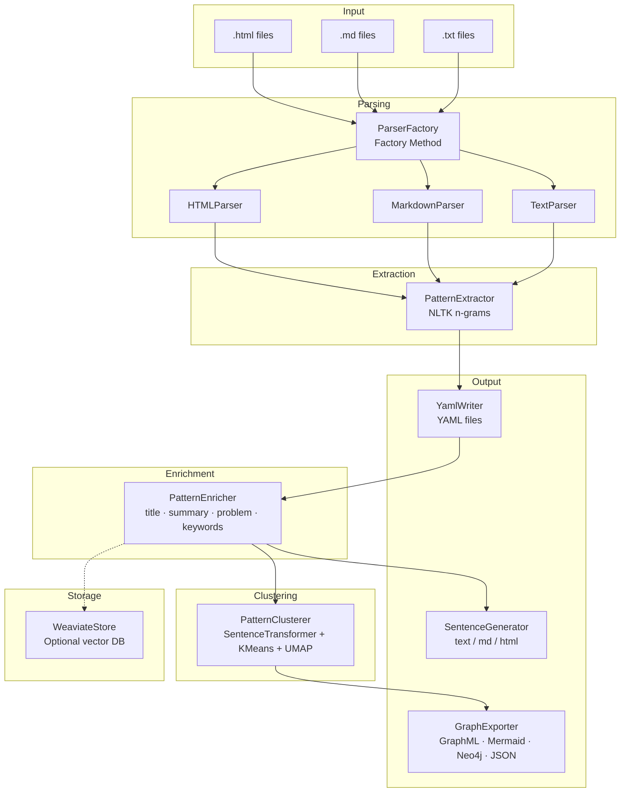
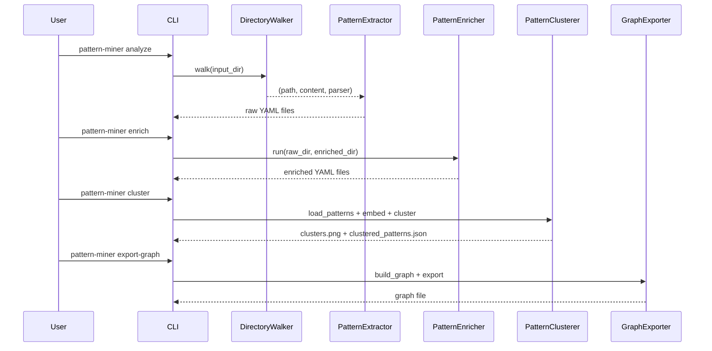

# Architecture

## System Overview

Pattern Language Miner is a modular Python application organised as a sequential pipeline. Each pipeline stage is an independent module with a clear, single responsibility.



---

## Package Structure

```
src/pattern_language_miner/
├── __init__.py            # Package metadata
├── cli.py                 # Click CLI entry-point
├── walker.py              # DirectoryWalker + ParserFactory
├── parser/                # BaseParser + concrete parsers
│   ├── base_parser.py
│   ├── text_parser.py
│   ├── markdown_parser.py
│   └── html_parser.py
├── extractor/             # Lexical extraction + semantic clustering
│   ├── pattern_extractor.py
│   └── semantic_cluster.py
├── enricher/              # Metadata inference
│   └── pattern_enricher.py
├── cluster/               # KMeans + UMAP clustering
│   └── pattern_cluster.py
├── generator/             # Natural language generation
│   └── generate_sentences.py
├── transform/             # Template-based generation (alt. generator)
│   └── generate_sentences.py
├── graph/                 # Knowledge-graph export
│   └── graph_export.py
├── writer/                # YAML file writer
│   └── yaml_writer.py
├── output/                # Legacy output helpers
│   ├── yaml_writer.py
│   └── assembly_generator.py
├── vector_store/          # Weaviate adapter (optional)
│   └── weaviate_store.py
├── pipeline/              # Pipeline + Observer pattern
│   ├── events.py
│   └── pipeline.py
├── patterns/              # Core Pattern data class
│   └── pattern.py
├── utils/                 # Shared utilities
│   ├── config_validation.py
│   ├── logging.py
│   └── progress.py
└── schema/                # JSON Schema files
    ├── config_schema.json
    ├── pattern-schema.json
    └── pattern_schema_extended.json
```

---

## Data Flow



---

## Module Responsibilities

| Module | Pattern | Responsibility |
|---|---|---|
| `walker.py` | Factory Method | Selects parser by file extension |
| `parser/` | Strategy | Interchangeable text/HTML/Markdown parsers |
| `extractor/pattern_extractor.py` | — | NLTK n-gram frequency mining |
| `enricher/pattern_enricher.py` | Strategy | Pluggable enrichment logic |
| `cluster/pattern_cluster.py` | — | Embedding + KMeans + UMAP |
| `generator/generate_sentences.py` | Template Method | Grammar-based sentence generation |
| `graph/graph_export.py` | Facade | Unified graph export interface |
| `writer/yaml_writer.py` | Builder | Assembles and writes YAML output |
| `vector_store/weaviate_store.py` | Adapter | Adapts Weaviate API to app interface |
| `pipeline/pipeline.py` | Chain of Responsibility | Orchestrates sequential pipeline steps |
| `pipeline/events.py` | Observer | Decoupled progress notifications |
| `cli.py` | Command | Encapsulates each workflow as a CLI command |
