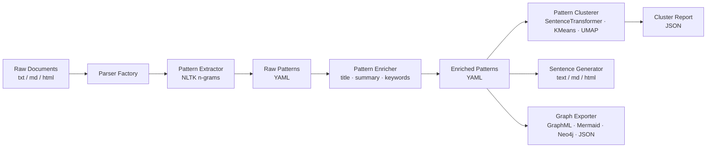

# Pattern Language Miner

**Pattern Language Miner** is a modular Python tool that automatically extracts, clusters, enriches, and exports reusable content patterns from Markdown, HTML, and plain-text document corpora.

---

## Why Pattern Language Miner?

Organizations produce large volumes of documentation — help content, reference guides, training material — but rarely identify or reuse the recurring structures hidden within it. This leads to:

- **Duplicated effort** across authoring teams
- **Inconsistent style and logic** between documents
- **Missed AI-reuse opportunities** from unstructured content

Pattern Language Miner solves this by automating the discovery and cataloguing of those recurring structures.

---

## Core Capabilities

| Capability | Description |
|---|---|
| **Extract** | Identify frequent lexical patterns using configurable n-gram and POS filters |
| **Enrich** | Automatically infer metadata (title, summary, keywords, problem) |
| **Cluster** | Group similar patterns using vector embeddings and KMeans/UMAP |
| **Generate** | Convert structured YAML into human-readable sentences or HTML |
| **Export** | Produce knowledge graphs (Mermaid, GraphML, Neo4j Cypher) |

---

## Quick Example

```bash
# 1. Extract patterns from your docs
pattern-miner analyze \
  --config config.yaml \
  --input-dir ./docs \
  --output-dir ./raw-patterns

# 2. Enrich with metadata
pattern-miner enrich \
  --input-dir ./raw-patterns \
  --output-dir ./enriched

# 3. Cluster by semantic similarity
pattern-miner cluster \
  --input-dir ./enriched \
  --output-dir ./clusters

# 4. Generate readable sentences
pattern-miner generate-sentences \
  --input-dir ./enriched \
  --output-path ./output.md \
  --format markdown
```

---

## Architecture Overview



---

## Inspired By

- Christopher Alexander's *A Pattern Language*
- Robert E. Horn's *Information Mapping*
- Modern NLP and discourse modelling practices

---

## Getting Started

New here? Start with the [Installation guide](user-guide/installation.md), then follow the [Quick Start](user-guide/quick-start.md) walkthrough.
