# Software Requirements Specification

**Product:** Pattern Language Miner
**Version:** 1.0.0
**Date:** 2024-03-01
**Status:** Approved

---

## 1. Introduction

### 1.1 Purpose

This Software Requirements Specification (SRS) describes the functional and non-functional requirements for the **Pattern Language Miner** — a corpus-driven command-line tool for extracting, enriching, clustering, and exporting reusable content patterns from text, Markdown, and HTML documents.

### 1.2 Scope

Pattern Language Miner automates the discovery of recurring linguistic structures in document corpora. It is targeted at technical writers, knowledge-management practitioners, information architects, and NLP engineers who need to build structured pattern libraries from unstructured content.

### 1.3 Definitions

| Term | Definition |
|---|---|
| **Pattern** | A structured, reusable content unit with context, problem, solution, and example fields |
| **Corpus** | A collection of documents used as the analysis input |
| **N-gram** | A contiguous sequence of *n* tokens from a text |
| **Enrichment** | Automated inference of metadata fields (title, summary, keywords) for a raw pattern |
| **Cluster** | A group of semantically similar patterns discovered by machine learning |
| **Embedding** | A numeric vector representation of text produced by a sentence-transformer model |
| **UMAP** | Uniform Manifold Approximation and Projection — a dimensionality reduction algorithm |
| **KMeans** | A centroid-based clustering algorithm |

### 1.4 References

- Christopher Alexander, *A Pattern Language* (1977)
- Robert E. Horn, *Mapping Hypertext* (1989)
- NLTK Documentation: <https://www.nltk.org/>
- Sentence-Transformers: <https://www.sbert.net/>
- Weaviate Documentation: <https://weaviate.io/developers/weaviate>

---

## 2. Overall Description

### 2.1 Product Perspective

Pattern Language Miner is a standalone command-line application with no mandatory external service dependencies. An optional Weaviate vector-database integration enables semantic similarity search over the pattern library.

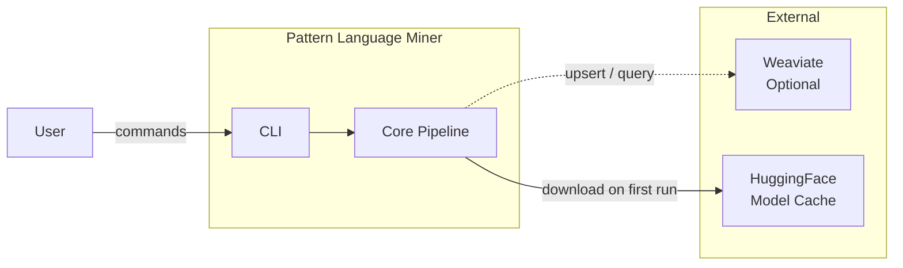

### 2.2 Product Functions

1. Parse Markdown, HTML, and plain-text documents into processable units
2. Extract frequent lexical n-gram patterns using configurable parameters
3. Enrich raw patterns with inferred metadata
4. Cluster patterns by semantic similarity and produce visual output
5. Generate human-readable sentences from structured patterns
6. Export pattern libraries as knowledge graphs in multiple formats
7. Optionally index patterns in Weaviate for semantic search

### 2.3 User Classes

| User Class | Description |
|---|---|
| **Technical Writer** | Mines their documentation corpus to identify reusable content structures |
| **Information Architect** | Builds pattern libraries for content governance and reuse strategies |
| **NLP Engineer** | Integrates the tool into automated content-processing pipelines |
| **Knowledge Manager** | Catalogues institutional knowledge from existing documentation |
| **DevOps / Automation Engineer** | Runs the pipeline in CI/CD to keep pattern libraries current |

### 2.4 Operating Environment

- Python 3.10 or later on Linux, macOS, or Windows
- Docker (optional, for Weaviate integration)
- Internet access on first run (to download NLTK data and sentence-transformer models)

### 2.5 Constraints

- NLTK sentence tokenisation is English-centric; multilingual corpora may yield lower quality patterns
- Sentence-transformer model inference is CPU-bound; large corpora benefit from GPU acceleration
- Weaviate integration requires OpenAI API key for `text2vec-openai` module

---

## 3. Use Cases

### 3.1 Use Case Diagram

```mermaid
graph TD
    TW([Technical Writer])
    IA([Information Architect])
    NLP([NLP Engineer])
    KM([Knowledge Manager])
    DE([DevOps Engineer])

    UC1[UC-01: Extract patterns from corpus]
    UC2[UC-02: Enrich patterns with metadata]
    UC3[UC-03: Cluster patterns by similarity]
    UC4[UC-04: Generate readable sentence list]
    UC5[UC-05: Export knowledge graph]
    UC6[UC-06: Summarise cluster groups]
    UC7[UC-07: Search patterns semantically]
    UC8[UC-08: Automate full pipeline]
    UC9[UC-09: Configure extraction parameters]

    TW --> UC1
    TW --> UC2
    TW --> UC4
    IA --> UC1
    IA --> UC3
    IA --> UC5
    IA --> UC6
    NLP --> UC1
    NLP --> UC3
    NLP --> UC7
    NLP --> UC8
    KM --> UC2
    KM --> UC6
    DE --> UC8
    DE --> UC9
```

---

### 3.2 Use Case Specifications

#### UC-01: Extract Patterns from Corpus

| Field | Detail |
|---|---|
| **Actor** | Technical Writer, Information Architect, NLP Engineer |
| **Goal** | Discover all recurring n-gram patterns in a document directory |
| **Preconditions** | Input directory exists and contains supported files; `config.yaml` is present |
| **Main Flow** | 1. User runs `pattern-miner analyze --config … --input-dir … --output-dir …`  2. System validates config against JSON Schema  3. System reads all files matching `file_type`  4. System tokenises and counts n-grams  5. System writes one YAML file per pattern meeting `frequency_threshold` |
| **Postconditions** | Output directory contains numbered YAML pattern files |
| **Alternate Flow** | If no files match the extension, system logs a warning and exits cleanly |
| **Exception Flow** | If config fails validation, system raises `ValidationError` with a descriptive message |

---

#### UC-02: Enrich Patterns with Metadata

| Field | Detail |
|---|---|
| **Actor** | Technical Writer, Knowledge Manager |
| **Goal** | Add human-readable metadata to raw patterns |
| **Preconditions** | Raw pattern YAML files exist in the input directory |
| **Main Flow** | 1. User runs `pattern-miner enrich --input-dir … --output-dir …`  2. System reads each YAML file  3. For each pattern, system infers missing `title`, `summary`, `problem`, and `keywords`  4. System writes enriched YAML to output directory |
| **Postconditions** | Each pattern file has `title`, `summary`, `problem`, and `keywords` fields |
| **Alternate Flow** | Existing fields are preserved unchanged |
| **Exception Flow** | Malformed YAML files are skipped with a WARNING log entry |

---

#### UC-03: Cluster Patterns by Similarity

| Field | Detail |
|---|---|
| **Actor** | Information Architect, NLP Engineer |
| **Goal** | Group semantically similar patterns and visualise the clusters |
| **Preconditions** | Enriched pattern YAML files exist in the input directory |
| **Main Flow** | 1. User runs `pattern-miner cluster --input-dir … --output-dir … --n-clusters N`  2. System embeds the specified field using a sentence-transformer model  3. System runs KMeans clustering  4. System reduces dimensions with UMAP  5. System saves `clusters.png` and `clustered_patterns.json` |
| **Postconditions** | Scatter plot and JSON report with cluster assignments are written |
| **Alternate Flow** | If `n-clusters > n_samples`, cluster count is reduced automatically |

---

#### UC-04: Generate Readable Sentence List

| Field | Detail |
|---|---|
| **Actor** | Technical Writer |
| **Goal** | Produce a human-readable output file from the pattern library |
| **Preconditions** | Enriched pattern YAML files exist |
| **Main Flow** | 1. User runs `pattern-miner generate-sentences --input-dir … --output-path … --format FORMAT`  2. System applies grammar template to each pattern  3. System writes formatted output (text / Markdown / HTML) |
| **Postconditions** | Output file exists and contains one sentence per pattern |

---

#### UC-05: Export Knowledge Graph

| Field | Detail |
|---|---|
| **Actor** | Information Architect |
| **Goal** | Export the pattern library as a machine-readable or embeddable graph |
| **Preconditions** | `clustered_patterns.json` exists |
| **Main Flow** | 1. User runs `pattern-miner export-graph --input-json … --output-path … --format FORMAT`  2. System builds a `networkx.DiGraph` with pattern, tag, concept, and related nodes  3. System serialises to the requested format |
| **Postconditions** | Graph file is written in the requested format |
| **Alternate Flow** | If an invalid format is supplied, a `ValueError` is raised |

---

#### UC-08: Automate Full Pipeline

| Field | Detail |
|---|---|
| **Actor** | NLP Engineer, DevOps Engineer |
| **Goal** | Run the entire pipeline in a single automated script |
| **Preconditions** | Config file and document corpus are available |
| **Main Flow** | 1. Engineer writes a shell script calling all six CLI commands in sequence  2. Each command writes output that becomes the next command's input  3. Script exits non-zero on any command failure |
| **Postconditions** | All output artefacts (YAML, JSON, PNG, graph file) are present |

---

## 4. Functional Requirements

### 4.1 Parsing

| ID | Requirement |
|---|---|
| FR-01 | The system SHALL support parsing of `.txt`, `.md`, `.markdown`, `.html`, and `.htm` files |
| FR-02 | The system SHALL use a factory method to select the parser based on file extension |
| FR-03 | The system SHALL log a WARNING and continue when a file cannot be read |

### 4.2 Extraction

| ID | Requirement |
|---|---|
| FR-04 | The system SHALL extract n-grams between `ngram_min` and `ngram_max` tokens in length |
| FR-05 | The system SHALL filter n-grams below `frequency_threshold` |
| FR-06 | The system SHALL support three scope modes: `line`, `sentence`, and `block` |
| FR-07 | The system SHALL optionally filter sentences by POS tags when `pos_filtering` is enabled |
| FR-08 | The system SHALL validate `config.yaml` against the bundled JSON Schema on startup |

### 4.3 Enrichment

| ID | Requirement |
|---|---|
| FR-09 | The system SHALL infer `title` from the `solution` field when absent |
| FR-10 | The system SHALL generate a `summary` sentence when absent |
| FR-11 | The system SHALL infer `problem` from the `solution` verb when absent |
| FR-12 | The system SHALL extract `keywords` from the `solution` field |
| FR-13 | The system SHALL preserve all existing field values unchanged |

### 4.4 Clustering

| ID | Requirement |
|---|---|
| FR-14 | The system SHALL embed pattern fields using a sentence-transformer model |
| FR-15 | The system SHALL cluster embeddings using KMeans with a configurable `n-clusters` |
| FR-16 | The system SHALL reduce embeddings to 2-D using UMAP |
| FR-17 | The system SHALL save a scatter plot PNG of the reduced embeddings |
| FR-18 | The system SHALL save a JSON report mapping each pattern to its cluster ID |

### 4.5 Generation

| ID | Requirement |
|---|---|
| FR-19 | The system SHALL produce output in `text`, `markdown`, and `html` formats |
| FR-20 | The system SHALL apply a configurable template to each pattern when using the transform module |

### 4.6 Graph Export

| ID | Requirement |
|---|---|
| FR-21 | The system SHALL export graphs as GraphML |
| FR-22 | The system SHALL export graphs as Mermaid diagram syntax |
| FR-23 | The system SHALL export graphs as Neo4j Cypher scripts |
| FR-24 | The system SHALL export graphs as node-link JSON |
| FR-25 | The system SHALL raise a `ValueError` for unrecognised format strings |

### 4.7 Logging

| ID | Requirement |
|---|---|
| FR-26 | The system SHALL write logs to `logs/pattern_miner.log` and to stdout |
| FR-27 | The system SHALL support log-level configuration via `--log-level` |
| FR-28 | All modules SHALL use module-scoped loggers (`logging.getLogger(__name__)`) |

---

## 5. Non-Functional Requirements

| ID | Category | Requirement |
|---|---|---|
| NFR-01 | **Performance** | The extraction step SHALL process a 1,000-file corpus in under 5 minutes on standard hardware (4-core CPU, 8 GB RAM) |
| NFR-02 | **Performance** | Embedding and clustering SHALL complete in under 10 minutes for 10,000 patterns on CPU |
| NFR-03 | **Reliability** | Any single malformed input file SHALL not halt the pipeline |
| NFR-04 | **Usability** | All CLI commands SHALL provide `--help` text |
| NFR-05 | **Usability** | All error messages SHALL be descriptive and actionable |
| NFR-06 | **Maintainability** | All public modules, classes, and functions SHALL have Google-style Sphinx docstrings |
| NFR-07 | **Maintainability** | Code SHALL comply with PEP 8 and pass `ruff` linting |
| NFR-08 | **Testability** | Unit test coverage SHALL be ≥ 80% of all non-trivial code paths |
| NFR-09 | **Portability** | The tool SHALL run on Python 3.10, 3.11, and 3.12 on Linux, macOS, and Windows |
| NFR-10 | **Security** | The tool SHALL NOT execute any shell commands from user-supplied input |

---

## 6. Class Diagrams

### 6.1 Core Domain

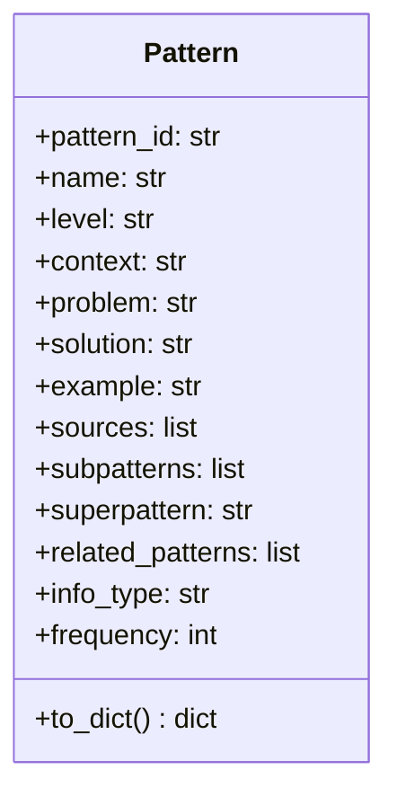

### 6.2 Parser Hierarchy

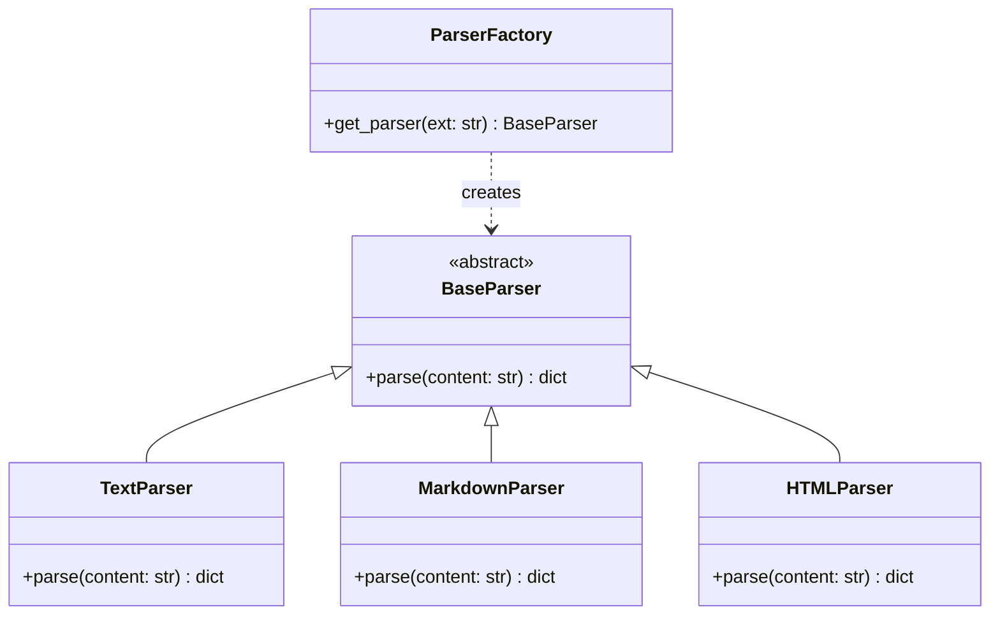

### 6.3 Extraction and Enrichment

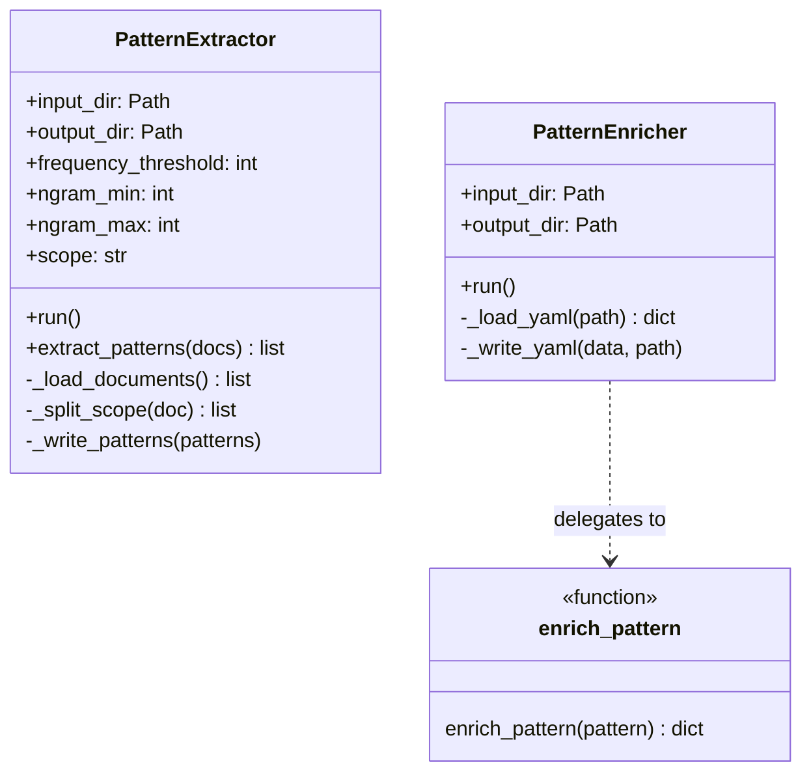

### 6.4 Clustering

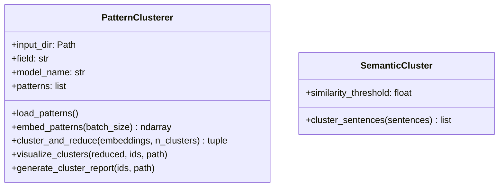

### 6.5 Pipeline and Observer

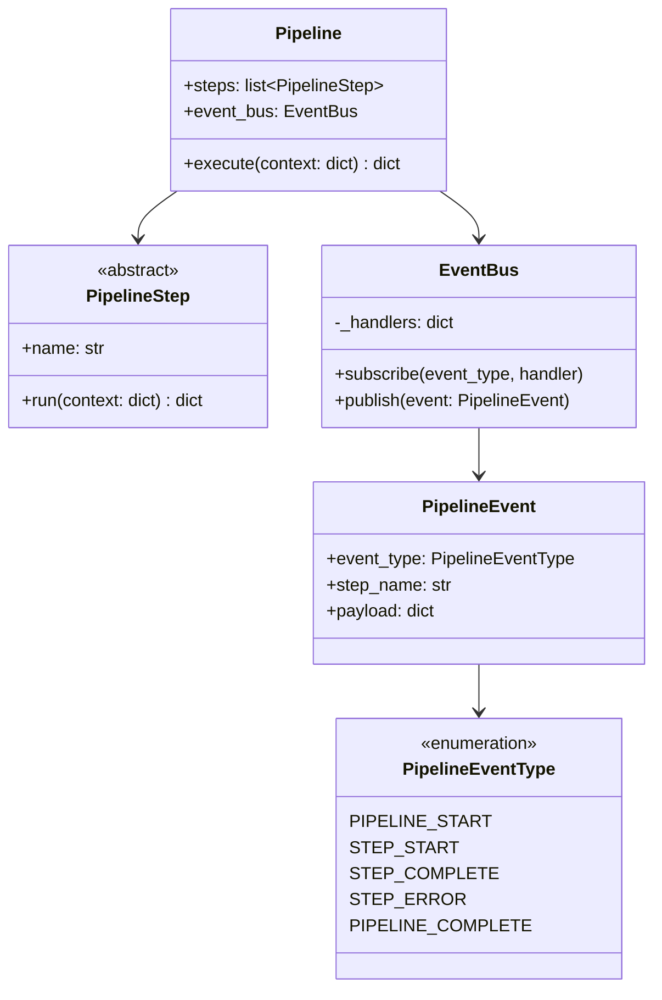

### 6.6 Graph Export

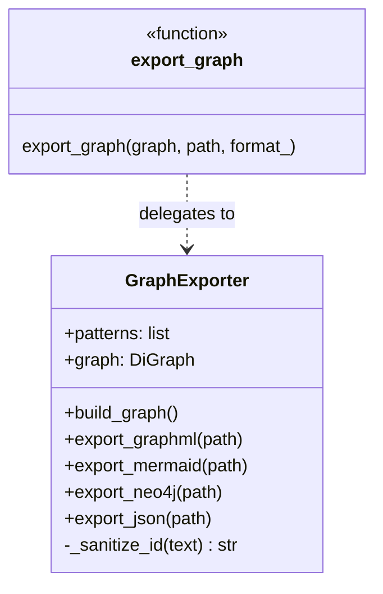

---

## 7. Sequence Diagrams

### 7.1 Full Pipeline

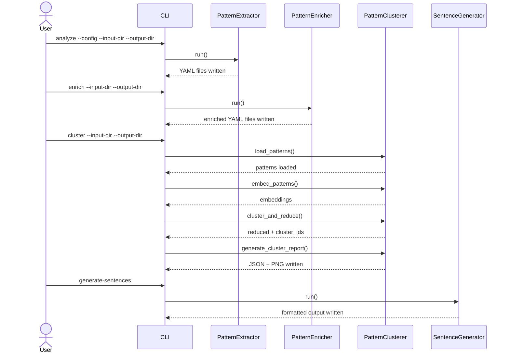

### 7.2 Config Validation

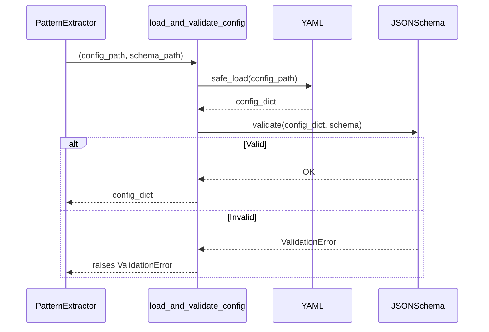

---

## 8. State Diagram

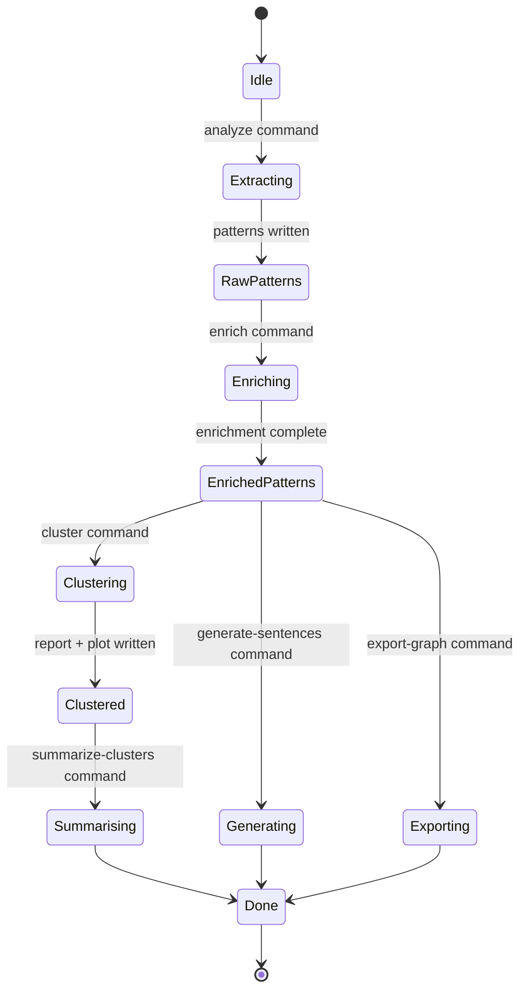

---

## 9. Component Diagram

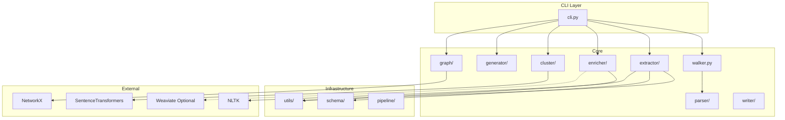

---

## 10. Acceptance Criteria

| ID | Criterion |
|---|---|
| AC-01 | `pattern-miner analyze` produces at least one YAML file for a corpus with repeated phrases |
| AC-02 | `pattern-miner enrich` adds `title`, `summary`, `problem`, and `keywords` to all patterns |
| AC-03 | `pattern-miner cluster` produces `clusters.png` and `clustered_patterns.json` |
| AC-04 | `pattern-miner generate-sentences` produces valid Markdown, HTML, and plain-text output |
| AC-05 | `pattern-miner export-graph` produces valid output for all four format options |
| AC-06 | Invalid `config.yaml` produces a descriptive error and non-zero exit code |
| AC-07 | All unit tests pass (`pytest tests/`) with no errors |
| AC-08 | All integration tests pass |
| AC-09 | `ruff check src/` reports zero violations |
