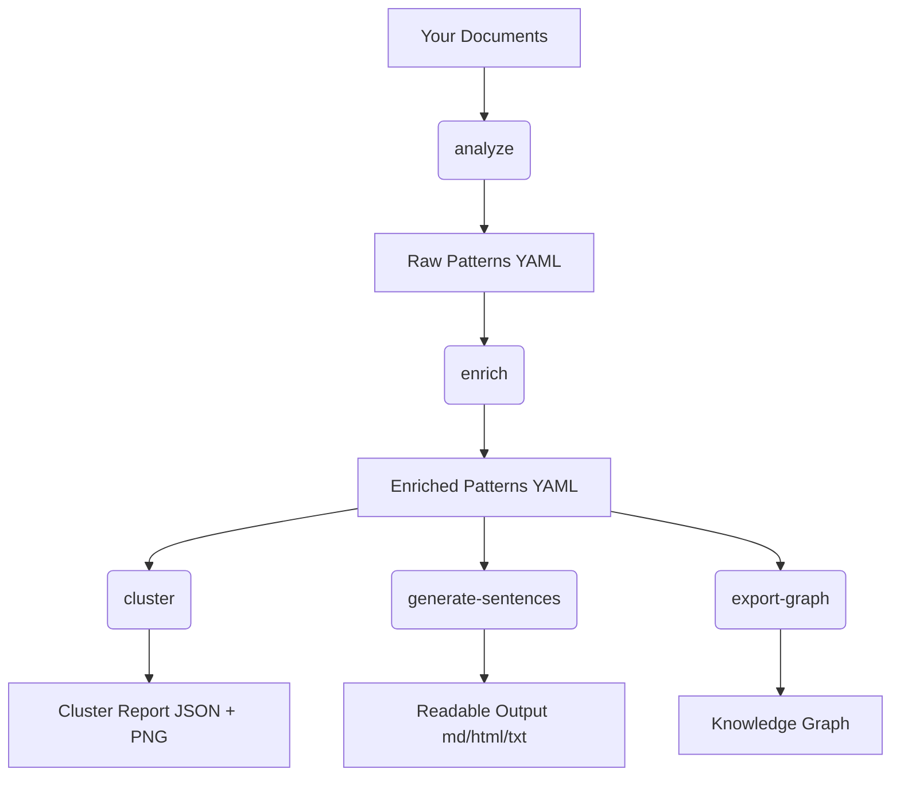

# Getting Started

This page introduces the core concepts behind Pattern Language Miner and helps you understand what the tool does before you run your first command.

---

## What Is a Pattern?

In Pattern Language Miner a **pattern** is a structured, reusable unit of knowledge with five essential fields:

| Field | Description |
|---|---|
| `context` | The situation in which the pattern applies |
| `problem` | The need or challenge being addressed |
| `solution` | How the pattern resolves the problem |
| `example` | A concrete illustration |
| `sources` | Files or sections where the pattern was found |

This structure is inspired by Christopher Alexander's *Pattern Language* and Robert E. Horn's *Information Mapping*.

---

## The Pipeline

Pattern Language Miner works as a sequential pipeline:

Each step is a separate CLI command, so you can run the full pipeline or just the parts you need.

---

## Key Concepts

### Configuration File
Most pipeline behaviour is controlled by a `config.yaml` file. See [Configuration](configuration.md) for all available options.

### YAML Pattern Files
Each extracted pattern is saved as an individual YAML file. This makes patterns easy to inspect, version-control, and edit manually.

### Semantic Clustering
The `cluster` command uses sentence embeddings (via `sentence-transformers`) to group semantically similar patterns — even if they use different words.

### Graph Export
The `export-graph` command converts your pattern library into a knowledge graph that can be visualised in tools like Gephi, imported into Neo4j, or embedded in documentation as a Mermaid diagram.

---

## Next Steps

- Follow the [Quick Start](quick-start.md) to run your first extraction.
- Read the [Commands](commands.md) reference for all CLI options.
- Learn about [Configuration](configuration.md) to tune the extractor.
