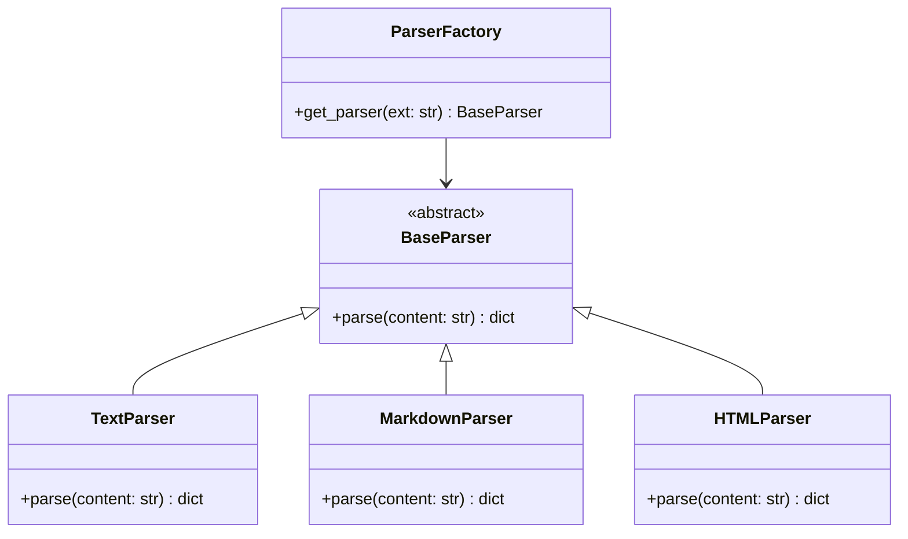
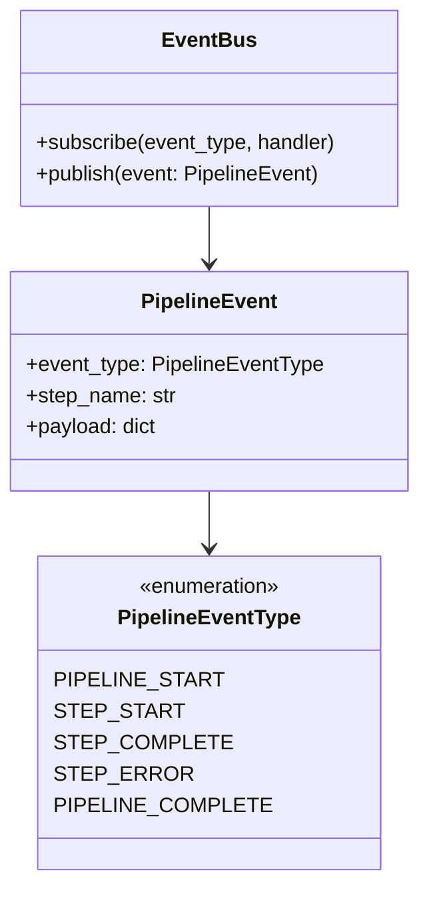
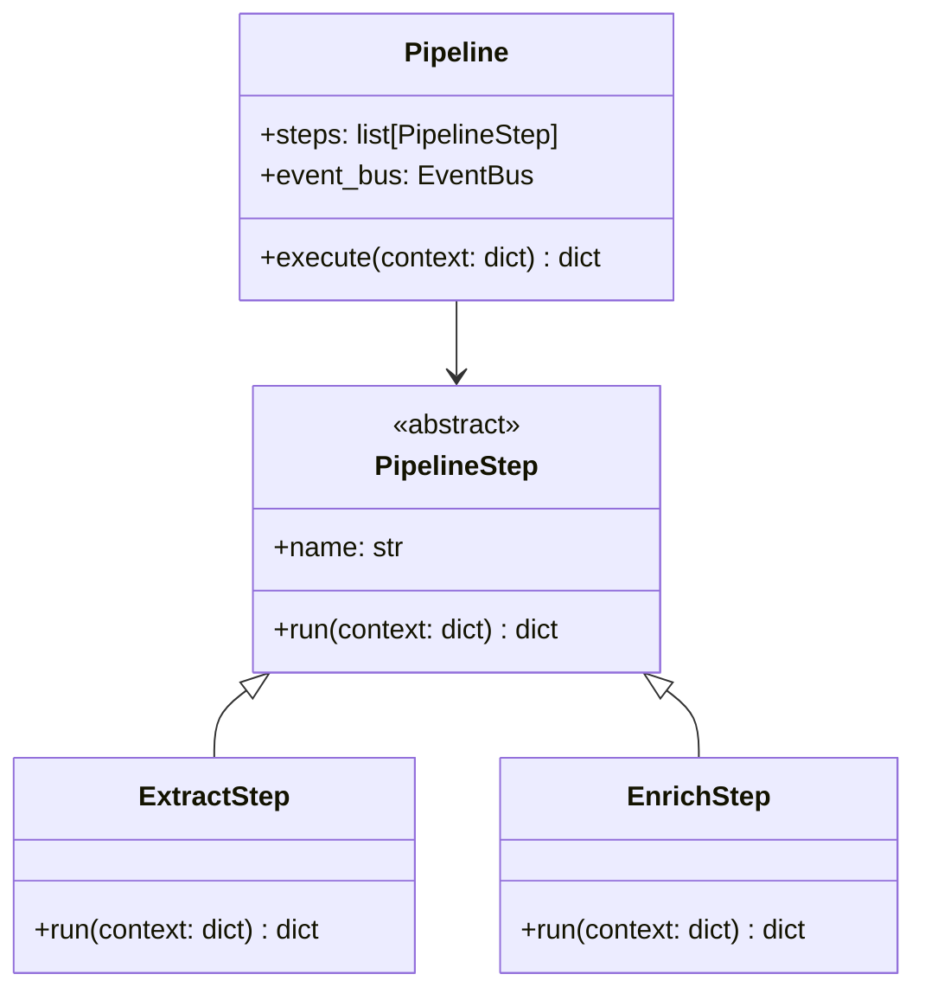

# Design Patterns

Pattern Language Miner applies classic software-engineering design patterns throughout its architecture to keep the codebase testable, extensible, and loosely coupled.

---

## Factory Method — `ParserFactory`

**Source:** `src/pattern_language_miner/walker.py`

`ParserFactory.get_parser()` returns the correct `BaseParser` subclass for a given file extension without exposing the instantiation logic to callers.

**Benefit:** Adding a new format (e.g. reStructuredText) requires only a new `BaseParser` subclass — no changes to `ParserFactory` switch logic.

---

## Strategy — Parsers

**Source:** `src/pattern_language_miner/parser/`

Each concrete parser (`TextParser`, `MarkdownParser`, `HTMLParser`) encapsulates a different parsing algorithm behind the uniform `parse(content) → dict` interface. `DirectoryWalker` selects and invokes the strategy at runtime.

---

## Strategy — Enrichment

**Source:** `src/pattern_language_miner/enricher/pattern_enricher.py`

The `enrich_pattern()` function is injected into `PatternEnricher.run()`. To swap the enrichment algorithm (e.g. replace the heuristic with an NLU model), replace or wrap this function without modifying the batch-processing logic.

---

## Observer / Event Bus — Pipeline Events

**Source:** `src/pattern_language_miner/pipeline/events.py`

`EventBus` implements the Observer pattern. Pipeline steps publish progress events; external consumers (UI, logging, progress bars) subscribe without coupling to the pipeline internals.

---

## Chain of Responsibility — `Pipeline`

**Source:** `src/pattern_language_miner/pipeline/pipeline.py`

`Pipeline` executes an ordered list of `PipelineStep` objects, passing a shared context dictionary from one step to the next. Each step processes the context and hands it on, forming a chain.

---

## Template Method — `BaseParser`

**Source:** `src/pattern_language_miner/parser/base_parser.py`

`BaseParser` defines the invariant interface (`parse` must return a dict with a `type` key). Subclasses override `parse` with their specific parsing algorithm.

---

## Builder — `YamlWriter`

**Source:** `src/pattern_language_miner/writer/yaml_writer.py`

`YamlWriter` constructs well-formed, numbered, sanitised YAML files from a list of pattern dictionaries. It encapsulates the file-naming, sanitisation, and serialisation steps.

---

## Adapter — `WeaviateStore`

**Source:** `src/pattern_language_miner/vector_store/weaviate_store.py`

`WeaviateStore` wraps the Weaviate client's verbose REST interface behind a clean `upsert_pattern / query_similar_patterns / delete_pattern` API that matches the expectations of the rest of the pipeline.

---

## Facade — `export_graph`

**Source:** `src/pattern_language_miner/graph/graph_export.py`

The `export_graph(graph, path, format_)` function provides a single entry-point for all graph export formats, hiding the dispatch logic and `GraphExporter` class from callers that already hold a pre-built `networkx.DiGraph`.

---

## Command — CLI

**Source:** `src/pattern_language_miner/cli.py`

Each Click command (`analyze`, `enrich`, `cluster`, `generate-sentences`, `summarize-clusters`, `export-graph`) encapsulates a distinct workflow operation, making each independently invocable, testable, and composable in shell scripts.
